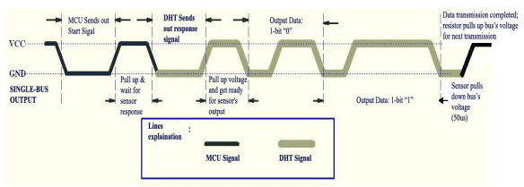

# DHT ESP32 Library

## 1. Installation
### PlatformIO GitHub
Add to your project's `platformio.ini` file:
```ini
lib_deps = 
    https://github.com/Cloudydesuu/DHT_ESP32.git
```

### ESP-IDF Component
- Copy the `dht` folder into your project's `components` directory.
- Add the following line to your project's CMakeLists.txt if needed:
```cmake
set(EXTRA_COMPONENT_DIRS components/dht)
```
- Include the library in your code:
```c
#include "dht.h"
```

### Manual Download
1. Download the library files from GitHub
2. Copy `include/dht.h` and `src/dht.c` to your project
3. Add the include path and compile `dht.c` with your project

## 2. Functions

### Data Structure Declaration:
```c
typedef struct {
    int temperature;  // Temperature (°C)
    int humidity;     // Humidity (%)
} dht11_data;
```

### Sensor Initialization Function:
```c
esp_err_t dht11_init(gpio_num_t gpio);
```
- Initialize the DHT11 sensor at the desired GPIO pin.

### Data Reading Function:
```c
esp_err_t dht11_read(dht11_data *data);
```
- Read temperature and humidity from the DHT11 sensor.
- Returns ESP_OK on success, or an error code on failure.

## 3. Working Principle



- The DHT11 sensor communicates with ESP32 via a single GPIO pin.
- The data reading process includes:
    1. ESP32 sends a start signal to DHT11 (hold low for at least 18ms).
    2. DHT11 responds with high/low signals for confirmation.
    3. DHT11 sends 40 bits of data (temperature, humidity, checksum) to ESP32.
    4. ESP32 checks the checksum to validate the data.

### Signal Timing Details:
- **Start Signal**: Pull data line low for 18-20ms, then high for 20-40μs
- **Response Signal**: DHT11 pulls low for 80μs, then high for 80μs  
- **Data Transmission**: Each bit represented by low (50μs) + high (26-28μs for '0', 70μs for '1')

### Hardware Setup:
```
DHT11 Sensor    ESP32
-----------    ------
VCC        ->  3.3V
GND        ->  GND
DATA       ->  GPIO
```

- The interval between readings should be at least 2 seconds for stable sensor operation.

---

Example usage:
```c
#include "dht.h"
#include "esp_log.h"
#include "freertos/FreeRTOS.h"
#include "freertos/task.h"
#define DHT_PIN GPIO_NUM_25

void app_main(void) {
    dht11_data dht_data;
    dht11_init(DHT_PIN);
    while (1) {
        if (dht11_read(&dht_data) == ESP_OK) {
            ESP_LOGI("DHT11", "Temperature: %d°C, Humidity: %d%%", dht_data.temperature, dht_data.humidity);
        } else {
            ESP_LOGW("DHT11", "Failed to read data");
        }
        vTaskDelay(pdMS_TO_TICKS(2000));
    }
}
```
