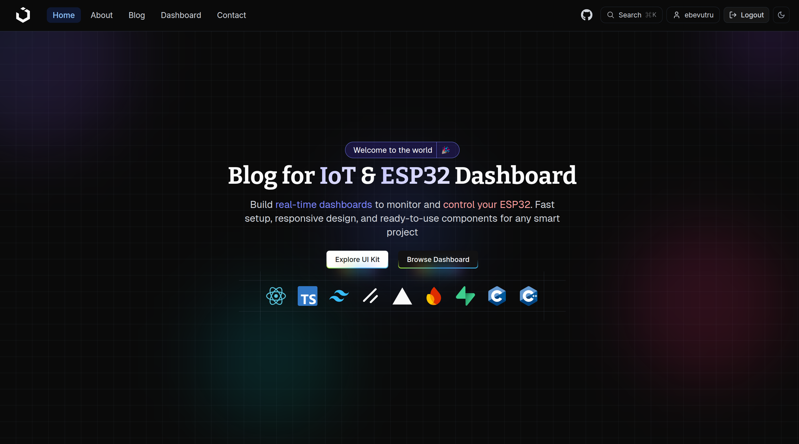

# IoT_Kit

A project for an IoT dashboard featuring various UI components such as charts, tables, and more. It also includes multiple hardware use cases that connect to the dashboard.

## Technologies

- HTML, CSS, JavaScript
- React, shadcn UI (for the dashboard)
- C/C++ (for hardware)
- Firebase (as the database)
- Authentication: supports Google and username/password login (Supabase)
- Server (Golang)

## Hardware

- ESP32
- More

---

I hope everything is clear and understandable. If you have any questions or need further clarification, please let me know.
